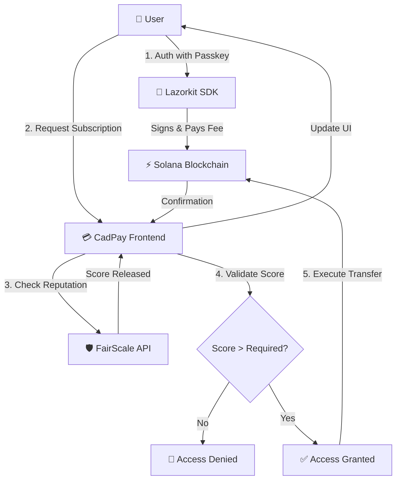

# CadPay - FairScale Sybil-Resistant Subscriptions

> **FairScale Integration** - Subscription payments with reputation-based Sybil protection on Solana.

CadPay demonstrates FairScale reputation scoring integration to prevent Sybil attacks on crypto subscription services. Built on Solana with Lazorkit Account Abstraction, users create passkey wallets and subscribe to services—with FairScale ensuring only trusted users can claim free resources.

## 🎯 FairScale Bounty Implementation

This project fulfills the [FairScale Solana Build Bounty](https://earn.superteam.fun/listing/fairscale-solana-build-bounty-ship-a-fairscore-powered-prototype) requirements:

**Sybil Protection Features:**
- 🛡️ **Faucet Protection** - Private treasury only funds wallets with FairScore ≥ 40
- 🏪 **Merchant Trust Gates** - Services can require minimum trust scores
- 📊 **Trust Dashboard** - Live reputation scoring with visual feedback
- 🔄 **Mock Integration** - Fully functional demo ready for live API credentials

## 🔑 Key Features

### Core Functionality
- 🔐 **Passkey Wallets** - Biometric login (Face ID, Touch ID, Windows Hello) via Lazorkit
- ⚡ **Gasless Transactions** - Lazorkit Paymaster sponsors all transaction fees
- 💳 **Subscription Management** - Netflix, Spotify, and custom services
- 📊 **Merchant Dashboard** - Live transaction tracking with trust requirements
- 🌟 **Jupiter DEX Integration** - Auto-swap subscriptions with best rates
- 🏦 **Savings Pots** - Create time-locked savings accounts with USDC
- 💸 **Send USDC** - Transfer tokens to any Solana address with memo support
- 📱 **Unified Send Modal** - Single interface for transfers and savings deposits

### FairScale Reputation Features
- **CadPay Reputation Boost** - Earn additional trust score points based on savings behavior
  - Base boost: +2 points per active savings pot
  - Duration multiplier: Extra points for long-term commitments (3, 6, 12+ months)
  - **Deposit tier bonuses**: 💎 Platinum (500+ USDC) = +15pts, 🏆 Gold (200-499) = +10pts, 🥈 Silver (50-199) = +5pts, 🥉 Bronze (1-49) = +2pts
  - Maximum boost: +30 points (capped)
- **Visual Score Display** - Real-time trust score with color-coded tiers
- **Deposit Tier Carousel** - View your active deposit tiers and bonuses
- **Auto-dismissing Boost Notifications** - Instant feedback when reputation increases

## 🏗️ Architecture Overview
> High-level data flow of the CadPay system.



**Flow Explanation:**
1.  **Authentication:** User signs in using biometric passkeys via Lazorkit (no seed phrases).
2.  **Reputation Check:** When a user attempts an action (e.g., Mint Faucet, Subscribe), CadPay queries FairScale.
3.  **Trust Enforcement:** 
    - If `FairScore < Threshold`: Transaction is blocked at the UI/API level.
    - If `FairScore ≥ Threshold`: Transaction proceeds.
4.  **Execution:** Lazorkit creates the transaction, signs as the fee payer (Gasless), and submits to Solana.

## 🛠️ Tech Stack

- **Framework:** Next.js 16.1.1 (React 19, Turbopack)
- **Blockchain:** Solana (Devnet)
- **Reputation:** FairScale API (Mock Integration)
- **Account Abstraction:** Lazorkit SDK v2.0.1
- **Payments:** USDC SPL Token (Devnet)
- **Token Library:** @solana/spl-token v0.4.9
- **Styling:** Tailwind CSS 4
- **Animations:** Framer Motion
- **Charts:** Recharts

## 📋 Prerequisites

- Node.js 18+ and npm
- Modern browser with WebAuthn support
- Device with biometric authentication (for passkey creation)

## 🚀 Quick Start

### 1. Clone & Install

```bash
git clone https://github.com/SamuelOluwayomi/solana-subscriptions-starter
cd solana-subscriptions-starter
npm install
```

> **Note:** If you encounter PowerShell execution policy errors on Windows, use:
> ```bash
> powershell -ExecutionPolicy Bypass -Command "npm install"
> ```

### 2. Environment Setup

Create `.env.local` in the project root:

```env
NEXT_PUBLIC_LAZORKIT_APP_ID=your_app_id_here
NEXT_PUBLIC_LAZORKIT_PUBLIC_KEY=your_public_key_here
NEXT_PUBLIC_RPC_URL=https://api.devnet.solana.com
NEXT_PUBLIC_SOLANA_NETWORK=devnet
NEXT_PUBLIC_APP_URL=http://localhost:3000

# REQUIRED: Treasury for automated account funding (bypasses FairScale for system operations)
TREASURY_SECRET_KEY=your_treasury_secret_key

# Optional: Address Lookup Table for transaction compression
NEXT_PUBLIC_LOOKUP_TABLE_ADDRESS=your_alt_address_here
```

**Getting Lazorkit Credentials:**
1. Visit [Lazorkit Dashboard](https://lazorkit.com)
2. Create a new app
3. Copy your App ID and Public Key
4. Add them to your `.env.local`

**Setting up Treasury:**
The treasury wallet is used for automated funding operations (profile creation, ATA creation) that bypass FairScale trust checks. Generate a new Solana keypair and fund it with devnet SOL.

### 3. Run Development Server

```bash
npm run dev
```

Open [http://localhost:3000](http://localhost:3000)

### 4. Build for Production

```bash
npm run build
npm start
```

## 📱 Complete Feature Guide

### 1. User Features (Dashboard)

#### Creating Your Account
1. Click "Create Account" on homepage
2. Follow the passkey creation flow (Face ID/Touch ID/Windows Hello)
3. Your smart wallet is created instantly (no seed phrases!)
4. Complete onboarding: username, avatar emoji, 4-digit PIN
5. Profile stored on-chain via Anchor program

#### Getting USDC
**Method 1: Faucet (Trust Score ≥ 40 Required)**
1. Navigate to "Wallet & Cards"
2. Click "Get Free USDC"
3. Mints 50 USDC to your account
4. FairScale check prevents Sybil attacks

**Method 2: Manual Transfer**
- Send USDC from another wallet to your smart wallet address
- Address visible in Overview section

#### Managing Subscriptions
1. **Browse Services**: Go to "My Subscriptions" → "Browse" tab
2. **Filter by Category**: Use dropdown to filter Entertainment, Productivity, etc.
3. **Subscribe**:
   - Click service card
   - Select plan (Monthly/Annual)
   - Review details
   - Confirm with passkey
4. **View Active**: Check "Active" tab to see current subscriptions
5. **Analytics**: View spending breakdown by service

#### Savings Pots (Earn Reputation!)
**Creating a Pot:**
1. Go to "Savings Wallet"
2. Click "Create New Pot"
3. Enter:
   - Pot name
   - Unlock date (time-locked)
   - Initial deposit amount
4. Confirm transaction
5. **Earn deposit tier bonus** based on amount!

**Depositing to Pot:**
1. Click "Send" button
2. Toggle "Savings Pot" option
3. Select pot from dropdown
4. Enter amount
5. Optional: Add memo (max 20 chars for savings)
6. **Your reputation score updates automatically!**

**Deposit Tier Bonuses:**
- 💎 **Platinum**: Deposit 500+ USDC → +15 reputation points
- 🏆 **Gold**: Deposit 200-499 USDC → +10 points
- 🥈 **Silver**: Deposit 50-199 USDC → +5 points
- 🥉 **Bronze**: Deposit 1-49 USDC → +2 points

**View Tiers:**
- Overview carousel (slide 3) shows all your active tiers
- See total bonus from all deposits
- Track progress to next tier

#### Sending USDC
1. Click "Send" from Overview or Wallet section
2. Enter recipient Solana address
3. Enter amount
4. Add optional memo (max 50 chars)
5. Choose "Transfer" (not savings)
6. Confirm with passkey

#### Viewing Your Reputation
- **Trust Score Card**: Shows FairScale base score + CadPay boost
- **Reputation Level**: Visual tier indicator (Bronze → Platinum)
- **Deposit Tiers**: Carousel slide showing active tier bonuses
- **Boost Notifications**: Auto-appear when your score increases

### 2. Merchant Features

#### Admin Access (No Wallet Required!)
**Demo Login Credentials:**
- Email: `demo@cadpay.xyz`
- Password: `admin123`
- **No Lazorkit popup** - bypasses wallet authentication
- Pre-loaded with demo transaction data

**What You Can Do:**
1. **View Live Transactions**: Real-time ledger of all payments
2. **Revenue Analytics**:
   - Total revenue (from actual transfer amounts)
   - MRR calculation based on subscriptions
   - Revenue split chart by service
3. **Customer Metrics**: Count unique wallet addresses
4. **Service Management**: View which services have FairScale trust gates

#### Creating Merchant Account (With Wallet)
For non-demo merchants who want their own wallet:
1. Go to `/merchant-auth`
2. Click "Create Account" tab
3. Enter business name, email, password
4. **Lazorkit popup appears** - create passkey wallet
5. Account created with associated wallet
6. Can receive payments to wallet address

### 3. FairScale Integration

#### How Trust Scoring Works
**1. Demo Stability Policy:**
> **Transparency Note:** To ensure a stable review experience if the FairScale Devnet API is unreachable or rate-limited during judging, this demo implements a **Deterministic Fallback Score**.
> - **Primary:** Attempts to fetch live score from FairScale API.
> - **Fallback:** If API fails/times out, computes a consistent score (60-99) based on the wallet address hash.
> - **Why?** This guarantees the UI never enters a "broken" state during your review, allowing you to test the "High Score" and "Low Score" flows reliably.

**2. Scoring Logic:**
**Base Score:**
- Wallet address generates deterministic score (0-100)
- Mock implementation for demo purposes
- Ready to swap for live API

**CadPay Boost (Your Actions):**
- Active savings pots: +2pts each
- Duration multiplier: 1-5x based on lock period
- **Deposit tiers: +2 to +15pts based on amount**
- Total boost capped at +30pts

**Final Score:**
```
Final Score = min(100, Base Score + CadPay Boost)
```

#### Trust Score Applications
1. **Faucet Access**: Need ≥40 to mint USDC
2. **Merchant Gates**: Services can require minimum scores
3. **Visual Feedback**: Color-coded tiers (Red/Orange/Green)

## 🔧 Recent Updates & Fixes

### January 2026
- ✅ **Updated @solana/spl-token** from v0.1.8 to v0.4.9 (fixed build errors)
- ✅ **Added missing SPL token imports** in dashboard page
- ✅ **Profile creation** - uses `/api/fund-rent` (bypasses FairScale for system operations)
- ✅ **Fixed TransactionTooOld** - pass instructions directly to Lazorkit for fresh blockhash
- ✅ **Fixed Transaction too large** - treasury creates ATAs via `/api/create-ata`
- ✅ **Deposit tier spacing** - tightened UI padding/margins
- ✅ **Admin merchant login** - bypasses Lazorkit popup for demo account
- ✅ **Deposit-based reputation tiers** - earn points based on savings amounts

## 🔄 FairScale Code Reference

### Mock Service (`src/services/fairscale.ts`)

```typescript
export async function getFairScore(walletAddress: string): Promise<FairScoreResponse> {
    // Mock implementation - generates deterministic score from wallet address
    const score = generateMockScore(walletAddress);
    const tier = score >= 70 ? 'HIGH' : score >= 40 ? 'MEDIUM' : 'LOW';
    
    return { 
        walletAddress, 
        score, 
        tier, 
        lastUpdated: new Date().toISOString(),
        factors: [] 
    };
}
```

### Faucet Protection (`src/app/api/faucet/route.ts`)

```typescript
const MINIMUM_FAUCET_SCORE = 40;

const scoreData = await getFairScore(userAddress);
if (scoreData.score < MINIMUM_FAUCET_SCORE) {
    return NextResponse.json({ 
        error: `Trust score too low (${scoreData.score}/100). Minimum ${MINIMUM_FAUCET_SCORE} required.`,
        requiredScore: MINIMUM_FAUCET_SCORE,
        currentScore: scoreData.score
    }, { status: 403 });
}
```

### Deposit Tier Calculation (`src/app/dashboard/page.tsx`)

```typescript
// Tiered Deposit Bonus - Earn more points for larger deposits
if (pot.balance >= 500) {
    depositBonus = 15; // Platinum
} else if (pot.balance >= 200) {
    depositBonus = 10; // Gold
} else if (pot.balance >= 50) {
    depositBonus = 5; // Silver
} else if (pot.balance >= 1) {
    depositBonus = 2; // Bronze
}
```

## 🌐 Live Demo

**Deployed URL:** [https://cadpay.vercel.app/](https://cadpay.vercel.app/)

**Test the Flow:**
1. Create a passkey wallet (works on any WebAuthn device)
2. Check your auto-assigned FairScale mock score
3. Try minting USDC (score ≥40 required)
4. Subscribe to demo services
5. **Create savings pots to boost your reputation**
6. **Watch your deposit tier bonuses accumulate**
7. Access merchant portal with demo credentials (no wallet needed!)

## 🏆 Bounty Requirements Met

- ✅ FairScale reputation scoring integrated (mock service)
- ✅ Sybil attack prevention on faucet endpoint
- ✅ Merchant-level trust requirements for services
- ✅ Visual trust score display with tier indicators
- ✅ **CadPay reputation boost for savings behavior**
- ✅ **Deposit-based tier bonuses (Bronze → Platinum)**
- ✅ Mock service ready for live API credentials
- ✅ Clean, well-documented codebase
- ✅ Live demo deployed on Devnet
- ✅ Comprehensive README with usage instructions

## 🔄 Switching to Live FairScale API

When official FairScale credentials arrive, update `src/services/fairscale.ts`:

```typescript
// Replace getMockFairScore implementation
export async function getFairScore(walletAddress: string): Promise<FairScoreResponse> {
    const response = await fetch('https://api.fairscale.io/v1/score', {
        method: 'POST',
        headers: { 
            'Authorization': `Bearer ${process.env.FAIRSCALE_API_KEY}`,
            'Content-Type': 'application/json'
        },
        body: JSON.stringify({ walletAddress })
    });
    
    if (!response.ok) {
        throw new Error(`FairScale API error: ${response.statusText}`);
    }
    
    return response.json();
}
```

Add to `.env.local`:
```env
FAIRSCALE_API_KEY=your_live_api_key_here
```

## 🐛 Troubleshooting

### Build Errors

**Issue:** `Cannot find name 'getAssociatedTokenAddress'`
- **Fix:** Ensure `@solana/spl-token` is version 0.4.9 or higher
- Run: `npm install @solana/spl-token@^0.4.9`

**Issue:** PowerShell execution policy errors (Windows)
- **Fix:** Use: `powershell -ExecutionPolicy Bypass -Command "npm install"`

### Runtime Errors

**Issue:** "TransactionTooOld" errors
- **Cause:** Blocker expired during biometric authentication
- **Fix:** ✅ Already fixed - instructions passed directly to Lazorkit

**Issue:** "Transaction too large" errors
- **Cause:** Smart wallet wrapper exceeds 1232-byte limit
- **Fix:** ✅ Already fixed - treasury creates ATAs via `/api/create-ata`

**Issue:** Profile creation fails with trust score error
- **Fix:** ✅ Already fixed - uses `/api/fund-rent` which bypasses FairScale

**Issue:** Balance not updating immediately
- **Cause:** RPC propagation delay
- **Fix:** Auto-refresh is enabled; wait 2-3 seconds

**Issue:** Lazorkit popup on merchant login
- **Fix:** ✅ Already fixed - use `demo@cadpay.xyz` to bypass wallet

## 📚 API Endpoints

### `/api/faucet` (POST)
- **Purpose**: Mint USDC to user wallet
- **FairScale Protection**: Requires score ≥ 40
- **Body**: `{ userAddress: string }`
- **Response**: `{ signature: string }`

### `/api/fund-rent` (POST)
- **Purpose**: Fund SOL for account rent (bypasses FairScale)
- **Use Case**: Profile creation, wallet funding
- **Body**: `{ accountAddress: string, rentAmount?: number }`
- **Response**: `{ success: true, signature: string }`

### `/api/create-ata` (POST)
- **Purpose**: Create Associated Token Accounts (bypasses transaction size limit)
- **Use Case**: Savings pot initialization
- **Body**: `{ ownerAddress: string, mintAddress: string }`
- **Response**: `{ success: true, ataAddress: string, signature: string }`

### `/api/fairscale/score` (GET)
- **Purpose**: Get FairScale trust score for wallet
- **Query**: `?walletAddress=...`
- **Response**: `{ score: number, tier: string, walletAddress: string }`

## 🐦 Connect

- **Live Demo:** [https://cadpay.vercel.app/](https://cadpay.vercel.app/)
- **GitHub:** [https://github.com/SamuelOluwayomi/solana-subscriptions-starter](https://github.com/SamuelOluwayomi/solana-subscriptions-starter)
- **X Announcement:** [Follow the project](https://x.com/The_devsam/status/2009888166329647558)

## 🙏 Acknowledgments

- **FairScale** for the reputation infrastructure and bounty program
- **Lazorkit** for Account Abstraction SDK and gasless transactions
- **Superteam** for organizing the bounty and supporting Solana builders
- **Solana Foundation** for the high-performance blockchain
- **Anchor** for the smart contract framework

## 📄 License

MIT License - see LICENSE file for details

---

**Built with ❤️ for the FairScale Solana Build Bounty**
